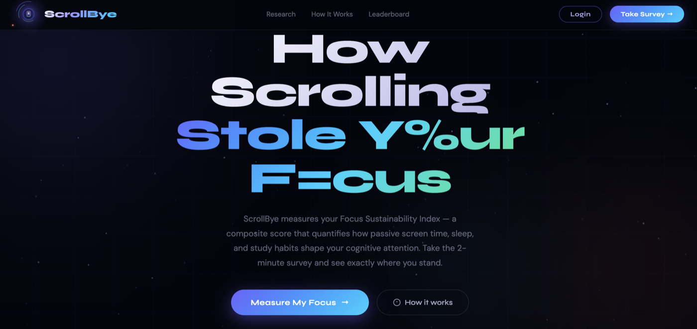

<div align="center">

<h1>ScrollBye</h1>

<p><strong>Know your screen. Own your focus.</strong></p>

<p>
  A science-fair-grade, full-stack web app that turns your screen time habits into a personalised <strong>Focus Score Index (FSI)</strong> — then lets you challenge your friends to beat it.
</p>

<p>
  Built for the <strong>IRIS National Science Fair</strong> by Agrim Sinha Roy.
</p>

<br/>



</div>

---

## Table of Contents

- [Overview](#overview)
- [Features](#features)
- [Screenshots](#screenshots)
- [Tech Stack](#tech-stack)
- [Getting Started](#getting-started)
- [Project Structure](#project-structure)
- [API Reference](#api-reference)
- [License](#license)

---

## Overview

ScrollBye is a research-driven screen-time survey platform for teens. Users complete a **6-step wizard** covering daily app usage, sleep quality, mood, and academic focus. The app runs these inputs through a weighted formula to produce an **FSI score out of 100** — a quantified measure of how much screen time is costing you in real focus, sleep, and productivity.

Scores are anonymous by default. Sign up to claim your score, appear on the **global leaderboard**, earn **XP**, and send **1-vs-1 challenges** to friends.

---

## Features

### Survey & Scoring
- **6-step wizard** — About You → Screen Time → Apps → Sleep → Mood → Focus
- **Focus Score Index (FSI)** — proprietary weighted formula across screen time, sleep, mood, and academics
- **App-hour mismatch detection** — live warning when declared total doesn't match individual app hours
- **Personalised insights** — emoji-driven, slide-in analysis cards for each dimension of your score
- **Cost breakdown** — animated counter showing the real-world cost (hours & ₹) of your screen time

### Accounts & Profiles
- **Register / Login** with secure password hashing (bcrypt)
- **Avatar upload** — custom profile picture stored server-side
- **XP system** — earn experience points for each survey completed
- **Session persistence** via MongoDB-backed sessions

### Leaderboard
- **FSI Leaderboard** — ranked by Focus Score (sign-in required to appear)
- **XP Leaderboard** — ranked by total XP earned
- Anonymous submissions are never shown; score only appears after you link to an account

### Challenges
- **Create a challenge** from your results page — generates a unique shareable link
- **Friends take the survey** through your link and get an instant head-to-head comparison
- **Challenger view** — see all responses with win/loss/tie badges
- **Responder view** — see your score vs the challenger's with a verdict banner
- Challenge links expire after **7 days**

### Dashboard & Progress
- Personal results dashboard with full FSI breakdown
- Historical submission tracking
- Daily log feature for habit monitoring

### Admin Panel
- Global stats overview (total users, submissions, average FSI)
- User management — promote to admin, ban accounts
- Protected behind admin-only middleware

---

## Screenshots


---

## Tech Stack

| Layer | Technology |
|---|---|
| Runtime | Node.js v18+ |
| Server | Express 4 |
| Database | MongoDB Atlas + Mongoose |
| Auth | express-session + connect-mongo + bcrypt |
| Templating | EJS (admin/legacy views) |
| Frontend | Vanilla JS — no framework |
| Fonts | Syne, DM Sans (Google Fonts) |
| File Uploads | Multer |

---

## Getting Started

### Prerequisites

- Node.js v18+
- A MongoDB Atlas cluster (free tier works)

### 1. Clone & install

```bash
git clone https://github.com/AgrimSinhaRoy/scrollstop.git
cd scrollstop
npm install
```

### 2. Configure environment

Create a `.env` file in the project root:

```env
MONGO_URI=mongodb+srv://<user>:<password>@<cluster>.mongodb.net/scrollbye_dev
SESSION_SECRET=replace_with_a_long_random_string
PORT=3000
```

### 3. Run

```bash
npm start
```

Open [http://localhost:3000](http://localhost:3000).

### Debug (VS Code)

Press **F5** — uses the included `.vscode/launch.json` to attach the Node.js debugger automatically.

### Dev (auto-reload)

```bash
npm run dev
```

---

## Project Structure

```
scrollbye/
├── app.js                  # Express server, Mongoose schemas, all routes & API
├── scrollstop2.html        # Survey wizard + live leaderboard modal
├── results.html            # Personalised results & challenge card
├── challenge.html          # Public challenge page (/challenge/:token)
├── dashboard.html          # Logged-in user dashboard
├── profile.html            # Avatar upload & account settings
├── login.html              # Register / Login (single page, tab-switched)
├── admin.html              # Admin panel
├── home.html               # Marketing landing page
├── public/
│   ├── css/style.css
│   ├── js/main.js
│   └── avatars/            # Uploaded user avatars
└── views/                  # EJS templates (legacy routes)
    ├── index.ejs
    ├── goals.ejs
    ├── log.ejs
    ├── insights.ejs
    └── partials/
        ├── header.ejs
        └── footer.ejs
```

---

## API Reference

### Auth

| Method | Route | Description |
|---|---|---|
| POST | `/auth/register` | Create a new account |
| POST | `/auth/login` | Log in |
| GET | `/auth/logout` | Destroy session and redirect to `/` |

### Survey

| Method | Route | Description |
|---|---|---|
| GET | `/survey` | Survey wizard page |
| POST | `/survey/submit` | Submit survey response → returns FSI + token |
| POST | `/api/claim-submission` | Link an anonymous submission to a logged-in account |

### User

| Method | Route | Description |
|---|---|---|
| GET | `/api/me` | Current session user info |
| GET | `/api/my-submissions` | All submissions for logged-in user |
| GET | `/api/my-latest-submission` | Most recent submission |
| GET | `/api/my-progress` | Saved daily progress log |
| POST | `/api/save-progress` | Save daily progress entry |
| POST | `/api/upload-avatar` | Upload profile picture |

### Leaderboard

| Method | Route | Description |
|---|---|---|
| GET | `/api/leaderboard` | Top FSI scores (linked accounts only) |
| GET | `/api/xp-leaderboard` | Top XP scores |

### Challenges

| Method | Route | Description |
|---|---|---|
| POST | `/api/challenge/create` | Create a challenge from a submission |
| GET | `/challenge/:token` | Public challenge page |
| GET | `/api/challenge/:token` | Challenge data (JSON) |
| POST | `/api/challenge/:token/respond` | Submit a response to a challenge |
| GET | `/api/my-latest-challenge` | Challenger/responder result for logged-in user |

### Admin *(requires admin role)*

| Method | Route | Description |
|---|---|---|
| GET | `/api/admin/stats` | Platform-wide stats |
| GET | `/api/admin/users` | All registered users |
| POST | `/api/admin/make-admin` | Promote a user to admin |
| POST | `/api/admin/ban-user` | Ban a user |

---

## License

MIT
